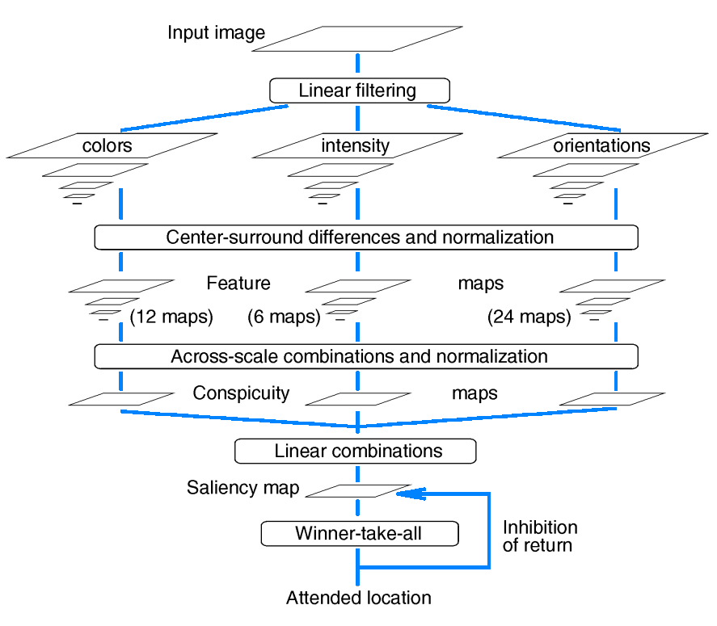

# saliency
A github repository containing various algorithms that generate saliency maps from images (Itti's Method ...). 

<style>
    :root{
        --function_color: #FF665E;
        --attribute-color: #23D18B;
    }
    
</style>

## Table of Contents
1. [General](#General)
2. [Documentation](#documentation)
    1. [Ittis-Method](#ittis-method)
3. [References](#references)

---

## General
This repository implements several algorithms for generating saliency maps (grows over time). All algorithms are implemented in [PyTorch](https://pytorch.org/). Furthermore we try to minimize the dependencies to other packages.

----

# Documentation
Below is the documentation of each class that creates a saliency map (the ``utils`` functions remain undocumented here and are only documented in the code itself).

### Itti’s Method

The class “Ittis method” is the implementation of the paper: **A Model of Saliency-Based Visual Attention for Rapid Scene Analysis** (See short Paper: [[1](#references)]).
Here, the class implements the adjacent image in the form of summarized functions.



Furthermore, the class is structured so that a simple and expert operation is possible. For the easy way of operation, the class can be simply imported and the `saliency_map` function can be called. As an expert, however, any subfunction of the class can be called and the intermediate results can be viewed. The `saliency_map` function therefore only summarizes the other subfunctions and calculates the overall result.
An easy example of the code is below:

```python
import torchvision
from ittis_method import IttisMethod

# Load rgb image
img = torchvision.io.read_image("data/cat.png")[0:3, ...] / 255.0

# Construct class and generate Saliency maps using Itti's method
ef = IttisMethod()
sm = ef.saliency_map(img)
```

TODO: Add image from result

**NOTE**: Because of the Pyramid images the in input image will be resized. As a limitation this class only takes images, that are larger than 256 px in height and width.


#### _class_  <span style="color: var(--function_color);">IttisMethod</span>(c: <span style="color: var(--attribute-color);">list</span> = [2, 3, 4], delta: <span style="color: var(--attribute-color);">list</span> = [3, 4])
A class for generating a saliency map using Itti’s method from the Paper:
`A Model of Saliency-Based Visual Attention for Rapid Scene Analysis`.

<dl>
  <dt><span style="color: var(--function_color);">center_surrounded_differences</span>(PyramidList_c: <span style="color: var(--attribute-color);">list</span>, PyramidList_s: <span style="color: var(--attribute-color);">list</span>)</dt>
  <dd>
  Calculates the center-surrounded difference for the given pyramid images. For a given pyramid image I(sigma) it performs the following equation for the two scales c and s: 
  
  $I(s,c) = | I_c(c) \ominus I_s(s) |$
  </dd>

  <dt><span style="color: var(--function_color);">colors</span>(img: <span style="color: var(--attribute-color);">Tensor</span>)</dt>
  <dd>Generates the color features for the given rgb image.</dd>

  <dt><span style="color: var(--function_color);">intensity</span>(img: <span style="color: var(--attribute-color);">Tensor</span>)</dt>
  <dd>Creates an intensity map from the given rgb image.</dd>

  <dt><span style="color: var(--function_color);">linear_combination</span>(I_dash: <span style="color: var(--attribute-color);">Tensor</span>, C_dash: <span style="color: var(--attribute-color);">Tensor</span>, O_dash: <span style="color: var(--attribute-color);">Tensor</span>)</dt>
  <dd>Calculates the saliency map S by the following formula:
  
  $S = \frac{1}{3}\left( \mathcal{N}(\bar{I}) + \mathcal{N}(\bar{C}) + \mathcal{N}(\bar{O}) \right)$
  </dd>

  <dt><span style="color: var(--function_color);">linear_filtering</span>(img: <span style="color: var(--attribute-color);">Tensor</span>)</dt>
  <dd>Performs the feature extraction and the follow up pyramid image generation.</dd>

  <dt><span style="color: var(--function_color);">normalize_map</span>(input_map: <span style="color: var(--attribute-color);">Tensor</span>)</dt>
  <dd>Normalizes the input map by the factor $(M-\mu)^2$, where $M$ is the maximum of the map and $\mu$ the mean of the map.

$\mathcal{N}(\mathbf{I}(x, y)) = (M-\mu)^2 \cdot \mathbf{I}(x, y)$
  </dd>

  <dt><span style="color: var(--function_color);">orientations</span>(img: <span style="color: var(--attribute-color);">Tensor</span>)</dt>
  <dd>Generates Gabor pyramids for the given input image.
For that purpose the image will be convertet using the `intensity` function and
then applied to the GaborPyramids class, which yield the gabor pyramids. </dd>

  <dt><span style="color: var(--function_color);">saliency_map</span>(img: <span style="color: var(--attribute-color);">Tensor</span>)</dt>
  <dd>Calculates the Saliency map using the Itti’s method.

For that purpose the subfunctions of this class will be used, to first calculate the features, then the center-surround differences,
which are followed by the across-scale combination and in the end the linear combination of the three maps.

Everything that this function calculates can be also done manually, if the corresponding subfunctions of this class are called in the right order.</dd>

</dl>

-----

# References

> [1]: L. Itti, C. Koch and E. Niebur, "A model of saliency-based visual attention for rapid scene analysis," in IEEE Transactions on Pattern Analysis and Machine Intelligence, vol. 20, no. 11, pp. 1254-1259, Nov. 1998, doi: 10.1109/34.730558.